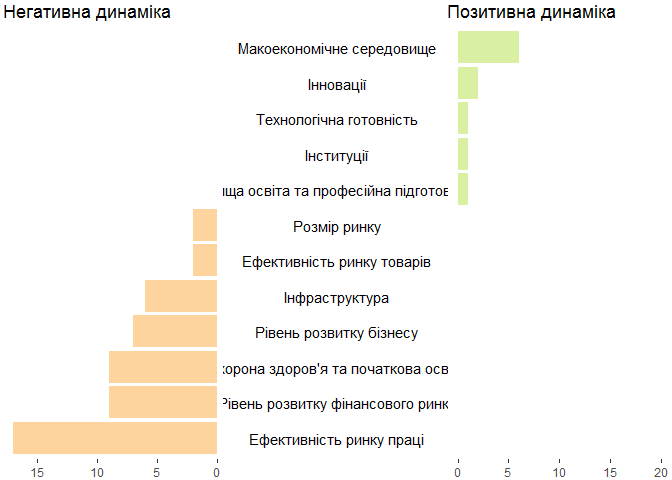

Підключимо необхідні бібліотеки

``` r
library(dplyr)
```

    ## 
    ## Attaching package: 'dplyr'

    ## The following objects are masked from 'package:stats':
    ## 
    ##     filter, lag

    ## The following objects are masked from 'package:base':
    ## 
    ##     intersect, setdiff, setequal, union

``` r
library(ggplot2)
library(grid)
library(gridExtra)
```

    ## 
    ## Attaching package: 'gridExtra'

    ## The following object is masked from 'package:dplyr':
    ## 
    ##     combine

Дані
----

Підготуємо спочатку дані для графіки

``` r
DATA <- data_frame(
  state = c("Макоекономічне середовище", "Інновації", "Вища освіта та професійна підготовка", 
            "Технологічна готовність", "Інституції", "Розмір ринку", "Ефективність ринку товарів", 
            "Інфраструктура", "Рівень розвитку бізнесу", "Охорона здоров'я та початкова освіта", 
            "Рівень розвитку фінансового ринку", "Ефективність ринку праці"),
  "Позитивна динаміка" = c(6,2,1,1,1,0.001,0.0001,0.00001,0.000001,0.0000001,0.00000001,0),
  "Негативна динаміка" = c(0,0,0,0,0,2,2,6,7,9,9,17)
)
```

Створення графіки
-----------------

Для створення такої графіки потрібно створити спочатку три окремі: два барчарти і легенду для них.

    ## Scale for 'y' is already present. Adding another scale for 'y', which
    ## will replace the existing scale.

Тепер елементі графіка склеюємо

``` r
gg1 <- ggplot_gtable(ggplot_build(g1))
gg2 <- ggplot_gtable(ggplot_build(g2))
gg.mid <- ggplot_gtable(ggplot_build(g.mid))

grid.arrange(gg1,gg.mid,gg2,ncol=3,widths=c(3/9,3/9,3/9))
```

 Готово!
